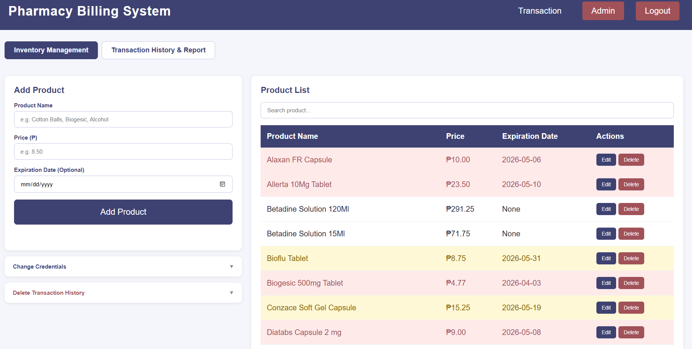

<div align="center">

# 💊 Pharmacy POS System

A lightweight, browser-based **Point of Sale (POS) system** built for a local pharmacy. Features a fast cashier transaction interface for processing walk-in sales and printing receipts, alongside a full admin panel for product management, sales reporting, and credential control.

[](https://www.php.net/)
[](https://www.mysql.com/)
[](https://developer.mozilla.org/en-US/docs/Web/JavaScript)
[](https://httpd.apache.org/)


</div>

---

## Table of Contents
- [Overview](#overview)
- [Features](#features)
- [Tech Stack](#tech-stack)
- [Getting Started](#getting-started)
- [Access Credentials](#access-credentials)
- [Project Structure](#project-structure)
- [Acknowledgements](#acknowledgements)
- [License](#license)

---

## Overview

This is a web-based **Point of Sale (POS) system** designed for a local pharmacy. The cashier interface allows staff to quickly search products, build a transaction cart, process cash payments, and print acknowledgement receipts. A separate admin panel enables authorized users to manage the product catalog, view sales history, generate reports, and update login credentials — all accessible through a standard web browser with no additional software required beyond XAMPP.

---

## Screenshots

### Billing /POS Screen


### Admin Panel


---

## Features

**Cashier / POS Interface**
- Real-time product search by name
- Add items to cart with automatic subtotal computation
- Cash tendered and change calculation
- Acknowledgement receipt generation and printing
- Duplicate transaction prevention (confirmation guard)
- Clear cart functionality

**Admin Panel**
- Secure login with PHP session management
- Credential management (change username and password)
- Full product management — add, edit, and delete products
- Complete transaction history with date-range filtering
- Receipt viewer for past transactions
- Clear transaction history by date range

---

## Tech Stack

| Technology | Purpose |
|---|---|
| PHP 8 | Backend logic, session handling, and REST-style API endpoints |
| MySQL | Database for products, users, and transactions |
| Vanilla JavaScript | Frontend interactivity and DOM manipulation |
| Apache (XAMPP) | Local development server |
| HTML5 / CSS3 | Structure and styling |

---

## Getting Started

### Requirements
- [XAMPP](https://www.apachefriends.org/) v8.x or higher (Apache + MySQL + PHP 8)
- Any modern browser (Chrome, Edge, Firefox)

### Installation

1. **Clone or download** this repository and place the folder inside your XAMPP `htdocs` directory (you can rename the folder):
   ```
   C:\xampp\htdocs\pharmacy-billing\
   ```

2. **Start Apache and MySQL** from the XAMPP Control Panel.

3. **Create the database:**
   - Open `http://localhost/phpmyadmin`
   - Create a new database named `pharmacy_billing`
   - Import the SQL file located in the `/database` folder

4. **Configure the database connection:**
   - Open `api/db.php` and confirm the following settings match your environment:
   ```php
   $host = 'localhost';
   $db   = 'pharmacy_billing';
   $user = 'root';
   $pass = '';
   ```

5. **Open the application** in your browser:
   ```
   http://localhost/pharmacy-billing/
   ```
   - For the cashier interface: `index.html`
   - For the admin panel: `admin.html`

---

## Access Credentials

| Interface | Credential |
|---|---|
| Admin Panel | Username: `admin` / Password: `password` |

> ⚠️ These are local development credentials only. Use the **Change Credentials** feature inside the Admin Panel before any live or shared deployment.

---

## Project Structure

```
pharmacy-billing/
├── index.html          # Cashier / transaction interface
├── admin.html          # Admin panel
├── style.css           # Global stylesheet
├── main.js             # Frontend logic (billing, cart, receipts)
├── api/
│   ├── db.php          # Database connection configuration
│   ├── auth.php        # Login, logout, session check, credential change
│   ├── products.php    # Product CRUD endpoints
│   └── transactions.php# Transaction recording, history, and clear
├── database/
│   └── pharmacy_billing.sql   # Full database schema and seed data
└── assets/
    └── logo.jpg        # Pharmacy logo
```

---

## Acknowledgements

Special thanks to the staff for their cooperation and feedback throughout the development of this system.

> Built as part of DC103 - System Analysis and Design · BSCS 2B · Group 6 · May 2026

---

## License

All rights reserved. Do not reuse, redistribute, or claim this work as your own without permission from the original authors.
